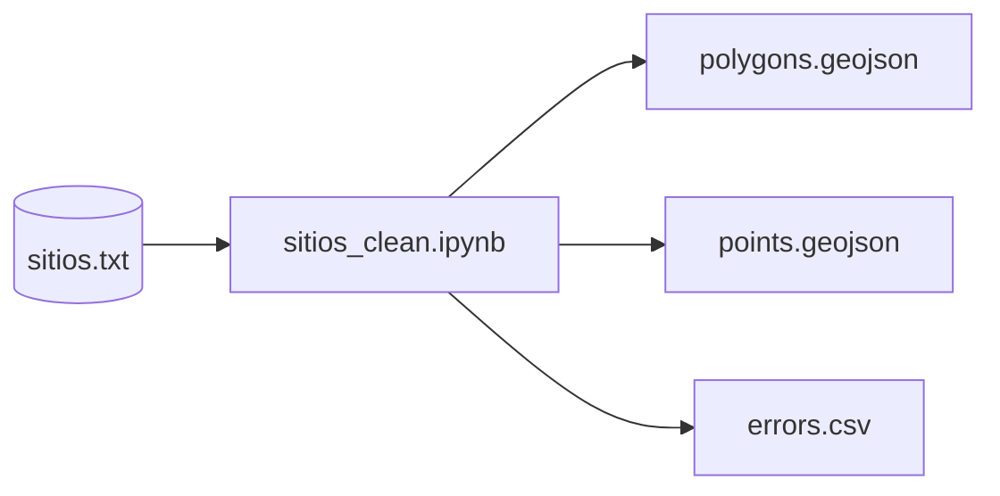

# Limpieza de datos geográficos del módulo sitios

El presente documento detalla el proceso de limpieza para la consulta generada a partir del módulo sitios.

El proceso genera tres salidas como se puede apreciar en el siguiente diagrama.

  

  

Para el script de **limpieza**, **transformación de datos a tipo georreferenciado** toma el supuesto de que la información de coordenadas son del tipo **decimal**. La información ingresada al sistema es a través de una proyección es del tipo CRS84 la cual es equivalente a EPSG: 4326, es decir, grados básicos de [WGS84](https://support.esri.com/en-us/gis-dictionary/wgs84).

Las salidas son de acuerdo al tipo de geometría encontrada de acuerdo a la longitud de elementos (coordenadas) capturas en el sistema.

En este caso para *puntos* esta formada por un par, para *polígonos* deben ser al menos 3 pares ordenados.

En *errores* se descartan aquellos con una longitud menor a 2 datos capturados. Al igual de aquellos registros que no cumpla con el supuesto de información del tipo coordenadas del tipo decimal.

